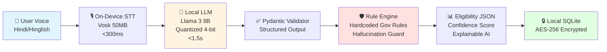

<div align="center">

# 🎯 Nyaaya.ai

### *Your Rights. Your Voice. Your Language.*

**A proposal for an offline-capable, voice-first AI assistant that helps rural Indians discover and claim government welfare benefits—without agents, without rejection, without losing dignity.**

[](LICENSE)
[](https://llama.meta.com/)
[](https://www.android.com/)
[](https://github.com)
[](https://flutter.dev)
[](https://fastapi.tiangolo.com/)

 [📖 Requirements](REQUIREMENTS.MD) • [🏗️ Architecture](DESIGN.MD) 

</div>

---

## 📌 Submission Overview

> **Hackathon**: Amazon National Hackathon 2026  
> **Team**: ByteCoke  
> **Category**: Social Impact + AI Innovation  
> **Submission Date**: February 2026  
> **Stage**: Idea / Proof-of-Concept Proposal

This document outlines our vision, proposed architecture, and implementation plan for **Nyaaya.ai**. The project is in the ideation and early design phase — no production code has been deployed yet.

---

## 🔥 The Problem: India's ₹1.5 Trillion Welfare Gap

Every year, an estimated **₹1.5 trillion** in government welfare benefits go unclaimed. Not because people don't qualify — but because the system is broken.

<table>
<tr>
<th>😞 Current Reality</th>
<th>✨ What Nyaaya.ai Aims to Change</th>
</tr>
<tr>
<td>

**4–5 office visits** (24+ hours of travel and waiting)  
**₹300–500 agent fees** (exploitative middlemen)  
**~78% rejection rate** (incomplete documentation)  
**English-only portals** (excludes ~80% of rural users)  
**Zero guidance** (users don't know what they qualify for)  
**Dignity loss** (harassment, dismissive treatment)

</td>
<td>

**Target: 1 office visit** (75% reduction)  
**₹0 agent fees** (direct empowerment)  
**Target: <20% rejection rate** (pre-verified via OCR)  
**Voice-first Hindi/Hinglish** (natural conversation)  
**AI-powered scheme discovery** (find 3–5 schemes per user)  
**Dignity preserved** (respectful, autonomous experience)

</td>
</tr>
</table>

> [!IMPORTANT]
> **The Dignity Score**: We don't just want to measure benefits claimed. We want to measure **office visits avoided**, **travel costs saved**, and **autonomy restored**. Because government schemes are a **right**, not charity.

---

## 🎯 Proposed Features

### 🎤 Voice-First Hinglish Interface
*"Mera husband 5 saal pehle pass ho gaya, mere paas 2 bacche hain..."*

No forms. No English. Users speak naturally in Hindi/Hinglish, and our proposed on-device AI would understand their life situation — extracting eligibility factors (age, income, dependents, location) in real-time.

- **On-Device Speech-to-Text**: Vosk Hindi model (~50MB, targeting <300ms latency)
- **Natural Language Understanding**: Llama 3 8B quantized (4-bit GGUF, runs offline)
- **Zero Cloud Dependency**: Voice data never leaves the phone

---

### 🧠 The Strategy Optimizer

Most existing tools tell you *what* you qualify for. Nyaaya.ai would tell you **how to maximize your benefits** — with a week-by-week action plan.

**Example Output**:
```
Week 1–8:   Apply for Widow Pension (₹600/mo, fast approval)
Week 4–12:  Apply for Child Education Grant (₹5,000, parallel track)
Week 12+:   Apply for Housing Subsidy (₹50,000, requires BPL card)

Estimated Year 1 Benefit: ₹62,200
```

**Why this matters**:
- **Sequential Dependencies**: BPL card approval can increase housing scheme chances by ~40%
- **Document Consolidation**: Aadhaar needed for 3 schemes? User is told once
- **Mutual Exclusivity Detection**: Flags conflicts (e.g., Old Age + Widow Pension)

---

### 🌐 Community Success Network

Government portals show eligibility rules. We want to show **real success stories** from the user's own district.

**Planned Features**:
- Peer-verified success stories matched by demographics and location
- Practical tips ("Visit office on Tuesday mornings — less crowded")
- Approval rate estimates by scheme and district, verified through NGO partners

**Trust Signals we'd surface**:
- ✓ Verified by NGO partner
- ✓ Cross-checked with government records
- ✓ Story updated within last 6 months

---

### 📱 100% Offline-Capable Design

62% of rural users have <500MB free storage and <1 Mbps connectivity. Cloud-first apps fail here. Nyaaya.ai is designed offline-first.

**Planned Offline Capabilities**:
- ✅ Full eligibility interview (branching logic, multi-turn clarification)
- ✅ Scheme comparison & optimization (1,000+ schemes per state)
- ✅ Success story browsing (district-level, pre-synced)
- ✅ Voice transcription (on-device via Vosk)
- ✅ Document OCR verification (Google ML Kit, offline)

**Sync Strategy**: Opportunistic background sync when WiFi is detected (never on 2G to preserve user data)

---

## 🏗️ The Intelligence Architecture



> [!TIP]
> **Why On-Device LLM?** Running Llama 3 locally would eliminate 3 critical failure modes:
> 1. **Network Dependency**: ~78% of target users have <1 Mbps (cloud calls time out)
> 2. **Privacy**: Sensitive data (income, caste, disability status) never leaves the device
> 3. **Cost at Scale**: 10M users × 5 queries/month × ~₹0.50/query = ₹25M/month in cloud costs. On-device = **₹0**.

---

## 🛠️ Proposed Tech Stack

<table>
<tr>
<th>Layer</th>
<th>Technology</th>
<th>Rationale</th>
</tr>
<tr>
<td><strong>Mobile App</strong></td>
<td>

**Flutter** (Dart, AOT compilation)

</td>
<td>

60fps UI on ₹5,000 phones (vs ~45fps React Native)  
~120ms cold start (vs ~380ms RN)  
~45MB memory footprint (vs ~78MB RN)

</td>
</tr>
<tr>
<td><strong>LLM Inference</strong></td>
<td>

**Llama 3 8B** (4-bit GGUF quantized)

</td>
<td>

~4.5GB model size (fits on 8GB phones)  
Targeting <1.5s inference on MediaTek Helio P22  
Offline-capable, privacy-preserving

</td>
</tr>
<tr>
<td><strong>Speech-to-Text</strong></td>
<td>

**Vosk** (Hindi model, ~50MB)

</td>
<td>

On-device, targeting <300ms latency  
No cloud dependency, zero marginal cost

</td>
</tr>
<tr>
<td><strong>Local Database</strong></td>
<td>

**SQLite + SQLCipher** (AES-256)

</td>
<td>

FTS5 full-text search  
Encrypted at rest, DPDP Act compliant

</td>
</tr>
<tr>
<td><strong>Backend API</strong></td>
<td>

**FastAPI** (Python, async I/O)

</td>
<td>

Auto-generated OpenAPI docs  
Type hints, Pydantic validation  
Async I/O for high concurrency

</td>
</tr>
<tr>
<td><strong>Database</strong></td>
<td>

**PostgreSQL 15** (JSONB, TDE)

</td>
<td>

Flexible schemas for evolving scheme data  
Transparent Data Encryption  
Plan to shard by state/district

</td>
</tr>
<tr>
<td><strong>Search Engine</strong></td>
<td>

**Elasticsearch 8** (Hybrid Search)

</td>
<td>

BM25 (keyword) + vector (semantic) hybrid  
District-specific keyword preservation  
Peer story matching

</td>
</tr>
<tr>
<td><strong>Cache</strong></td>
<td>

**Redis 7** (in-memory)

</td>
<td>

Frequently accessed scheme data  
Session management, rate limiting

</td>
</tr>
<tr>
<td><strong>Storage</strong></td>
<td>

**AWS S3** (object storage)

</td>
<td>

Peer story images, scheme PDFs  
CDN integration for fast delivery

</td>
</tr>
</table>

---

## 📊 The Dignity Score: Measuring What Matters

We don't want to just count app downloads. We want to measure **human impact**.

<div align="center">

### 🎯 Target Impact Metrics (Year 1)

| Metric | Current State | Nyaaya.ai Target | Expected Impact |
|--------|---------------|-------------------|-----------------|
| **Office Visits** | 4–5 visits | 1 visit | **75% reduction** |
| **Travel + Agent Costs** | ~₹1,500/user | ₹0 | **₹1,500 saved/user** |
| **Rejection Rate** | ~78% | <20% | **~58pp improvement** |
| **Schemes Discovered** | 0–1 | 3–5 | **3–5x increase** |
| **Time to Approval** | 16+ weeks | 8–12 weeks | **~50% faster** |
| **User Autonomy** | Agent-dependent | Self-sufficient | **Dignity restored** |

</div>

> [!NOTE]
> **Why "Dignity"?** Rural users — especially women, elderly, and disabled citizens — face harassment, long waits, and dismissive treatment at government offices. Nyaaya.ai aims to empower users with **knowledge** so they can advocate for themselves.

**Year 1 Goal**: ₹500M in benefits claimed across pilot states (Maharashtra, Rajasthan, UP)

---

## 🗺️ Roadmap

### Phase 1: MVP (Months 1–6)
- [ ] Core eligibility interview engine (Hindi)
- [ ] Scheme comparison & optimizer
- [ ] Offline functionality (200MB data package)
- [ ] Pilot in 2–3 states (Maharashtra, Rajasthan, UP)
- [ ] Seed 1,000 verified peer stories
- [ ] Android app

### Phase 2: Scale (Months 7–12)
- [ ] Community validation network (peer chat)
- [ ] Expand to 5 additional states (Tamil Nadu, Karnataka, West Bengal, Gujarat, MP)
- [ ] 10,000+ peer stories
- [ ] Performance optimization (target: <1.5s total latency)
- [ ] Security audit + penetration testing

### Phase 3: Expand (Months 13–18)
- [ ] Multi-language support (Tamil, Telugu, Kannada, Bengali, Marathi)
- [ ] All 28 states + 8 union territories
- [ ] Government API integration (where available)
- [ ] NGO Pro Mode (agent partnership program)
- [ ] iOS app (Swift, on-device Core ML)

### Phase 4: Scale to 10M Users (Months 19–24)
- [ ] Real-time government application submission via API
- [ ] Video call with government officers (NIC partnership)
- [ ] Biometric authentication (Aadhaar integration)
- [ ] UPI-based in-app payments for optional agent services
- [ ] AI-powered document generation (auto-fill application forms)


</div>
